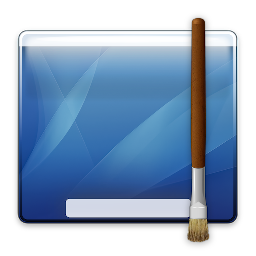
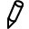
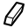

# PaintTheDesktop

### **[Download Here](https://github.com/shysaur/PaintTheDesktop/releases)**

## What is it?

**PaintTheDesktop** is a bitmap drawing program whose canvas is your Mac's screen.
Everything you draw will sit on top of anything else, exception made for PaintTheDesktop's own UI.
Each drawing is associated to a specific *screen*, so even if you switch spaces
the drawing will persist.

PaintTheDesktop was made during the [COVID-19 pandemic](https://en.wikipedia.org/wiki/COVID-19_pandemic)
as a tool for use during remote teaching. In that context, it was used to draw notes 
and graphs while writing code with a graphics tablet. Of course PaintTheDesktop can be used
however you want.

PaintTheDesktop works on macOS 10.13 High Sierra up to macOS 10.15 Catalina -- and potentially
other future macOS releases.

## How to use it

Drawing mode is toggled using a button in the menu bar. Once in drawing
mode, the menu bar and the dock are the only system UI elements that are still
enabled. Even though other windows may appear as active, when in drawing mode
all mouse action is captured by PaintTheDesktop.

Option-Click or Right-Click anywhere on the screen to enter the **ring menu** where you can
change:

 - The size of the tool (for some tools)
 - The paint color of the tool (for some tools)
 - The tool itself
 
The tools available are:

 -  Pencil
 -  Eraser
 -  Rectangle
 -  Oval
 -  Rounded Rectangle
 -  Reset (erase the entire screen where you click)
 
You can also quit from the ring menu.
 
Alt-Click on the menu bar button to save or reload a drawing.
